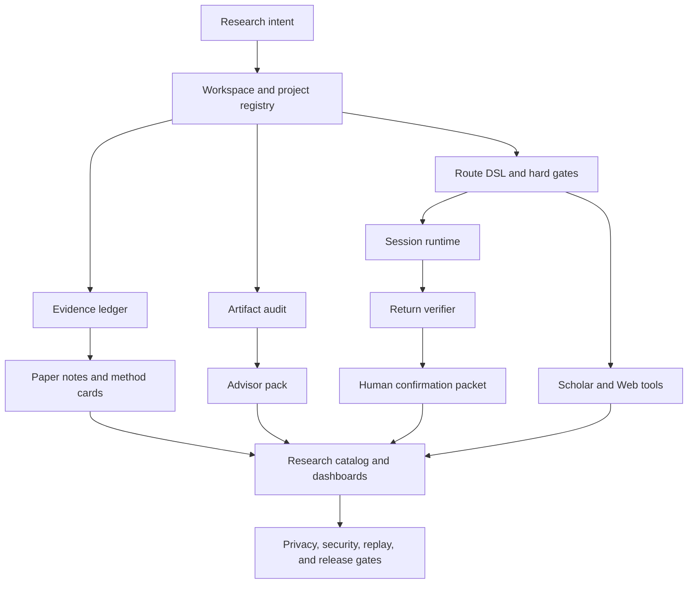

# TuringResearch

Local-first Research OS infrastructure for keeping evidence, artifacts, routes,
paper notes, dashboards, plugins, and release gates reviewable.

TuringResearch is not an autonomous scientist. It is a fake/demo-first,
privacy-first Research OS for humans who need complex research projects to stay
auditable.

TuringResearch helps researchers keep complex research state auditable without
pretending to automate judgment.

TuringResearch is fake/demo-first by default. Live adapters are optional and
disabled by default.

```text
Default mode: fake/local
Live mode: optional, private, and disabled by default
Remote execution: disabled by default
Evidence updates: require human review
```

Start here:

- [`docs/v1.0.0-quickstart.md`](docs/v1.0.0-quickstart.md)
- [`docs/v1.0.0-public-demo-walkthrough.md`](docs/v1.0.0-public-demo-walkthrough.md)
- [`docs/README.md`](docs/README.md)
- [`docs/v1.1.0-final-scope.md`](docs/v1.1.0-final-scope.md)

## What Is TuringResearch?

TuringResearch helps organize research work as typed, reviewable state:

- what is planned;
- what has evidence;
- what is missing;
- which artifacts are safe to share;
- which routes are blocked;
- which claims still need human review.

It combines local workflows, docs, contracts, demos, and static dashboards so a
research project can be inspected without pretending that software has finished
the science.

## Why It Exists

## Problem

Research projects often spread across notebooks, papers, run folders, remote
machines, advisor notes, dashboards, and half-remembered claims. The hard part
is not just generating more text. The hard part is keeping the work honest.

TuringResearch exists to make these boundaries explicit:

- planned work is not observed evidence;
- fake/demo output is not a research result;
- retrieved paper or web context is not automatically verified;
- remote return artifacts do not enter an evidence ledger without confirmation;
- public demos must not expose private paths, raw data, secrets, or restricted
  model payloads.

## Architecture



The repository is intentionally local-first. The default path should run
without API keys, live network access, Modal, SSH/SFTP, private project
folders, raw datasets, or restricted body-model files.

## Visual Tour

The visual tour is the public demo, architecture diagram, static dashboard, and
parity showcase material. These assets explain the workflow; they are not
experiment evidence.

## Core Capabilities

| Area | What it does | Default boundary |
| --- | --- | --- |
| Workspace | Project registries, templates, cross-project summaries | local files only |
| Evidence | Claim status, planned/observed separation, ledgers | no automatic promotion |
| Artifact audit | Public-safety checks for files and handoff bundles | no raw data packaging |
| Route DSL | Experiment intent, hard gates, failure taxonomy | runbook only |
| Session runtime | Preflight, context pack, script export, fake transfer, return verification | no remote command execution |
| Scholar tools | Paper search/content/reference/reading fake workflows | no paper download by default |
| Web tools | URL normalization, cache manifests, content extraction fixtures | no default network or private scraping |
| Research catalog | Catalog, vault/wiki, ontology, stress, convergence reports | review-only outputs |
| Dashboard | Static local HTML/Markdown views and public demo surfaces | no hosted service required |
| MCP / plugins | Local MCP config, plugin manifests, compatibility reports | plugin/live tools disabled by default |
| Privacy and release gates | Secret scans, name integrity, replay, regression checks | public-safe review first |

## Core Modules

The core modules are implemented as local Python packages plus docs, examples,
contracts, dashboards, and replay tests. They are designed to be inspected and
extended in small pieces instead of hidden behind a hosted service.

## Quickstart

Install locally in editable mode:

```powershell
python -m pip install -e .[dev]
```

Run the default fake/local checks:

```powershell
python -m pytest -q
python -m mypy src
```

Default tests use fake services, local fixtures, and dry-run workflows. They do not require real API keys or live network access.

Try the public-safe quickstart path:

```powershell
python -m pytest tests/workflow/test_public_demo_suite.py tests/workflow/test_public_demo_expansion.py -q
python -m pytest tests/workflow/test_v1_public_quickstart_fake.py -q
```

Useful entry points:

- [Quickstart](docs/quickstart.md)
- [v1.0 Public Quickstart](docs/v1.0.0-quickstart.md)
- [Install guide](docs/install.md)
- [Docs home](docs/README.md)
- [Examples](docs/examples.md)

## Public Demo

The public demo is fake/demo only. It does not require private data, API keys,
VGGT data, restricted model files, remote machines, or live network access.

Open or inspect:

- `examples/public_demo/README.md`
- `examples/public_demo/QUICKSTART.md`
- `examples/public_demo/WALKTHROUGH.md`
- `examples/public_demo/dashboard/index.html`
- `examples/public_demo/projects/vggt_like_demo/`
- `examples/public_demo/projects/paper_survey_demo/`
- `examples/public_demo/projects/software_tooling_demo/`

The demo shows evidence ledger inspection, artifact review, static dashboards,
advisor-pack material, and benchmark replay. It does not run real experiments,
does not generate real research results, and does not turn fake/demo material into observed evidence.

## VGGT Case Study

The VGGT-style case material is public-safe and demo-oriented. It is useful for
showing how TuringResearch separates project intent, artifact review, advisor
notes, and evidence status, but it is not proof that any VGGT experiment succeeded.
It does not claim SparseConv3D success and does not package raw VGGT data,
private project paths, or restricted model payloads.

TuringResearch does not claim VGGT experiment success or SparseConv3D success,
and does not claim VGGT or SparseConv3D experiment success.

## Original Repo Parity

TuringResearch replicated the stable, public, production-relevant ideas from
the original reference repositories into local fake/default workflows. It did
not copy unsafe behavior and does not claim live-provider proof.

### v1.3 Original Reference Parity

v1.3 established original reference parity for the public fake/default surface:
Neocortica Session parity, Neocortica Scholar parity, Neocortica Web parity,
yogsoth parity, MCP/tool parity, campaign traces, research catalog dashboards,
and convergence reports. ARIS | deferred and reference-only: no cross-model
review, no proof-checker, no meta-optimize, and no paper-claim-audit.

### v1.4 Original Repo Production Parity

v1.4 moved the same scope from structural parity into production parity for
fake/default workflows: Session production parity, Scholar production parity,
Web production parity, and yogsoth-ai production parity. This keeps no default
network, no automatic remote execution, and no remote command execution as
hard boundaries.

| Reference area | Current status | Boundary |
| --- | --- | --- |
| Neocortica Session | production parity for fake/default local workflows | no default SSH/SFTP, tmux, provisioning, or remote command execution |
| Neocortica Scholar | production parity for fake/default paper tooling | no MinerU, heavy OCR, paper download, paywall bypass, or fake citation verification |
| Neocortica Web | production parity for fake/default web tooling | no default network, private scraping, cookies, login bypass, or live Apify |
| yogsoth-ai | production parity with deterministic review workflows | no autonomous agent runtime or automatic experiment execution |
| ARIS | deferred | future study only; no cross-model review, proof-checker, meta-optimize, or paper-claim-audit |

Read more:

- [Original repo replication progress report](docs/original-repo-replication-progress-report.md)
- [Original repo replication scorecard](docs/original-repo-replication-scorecard.md)
- [Reference parity dashboard](docs/reference-parity-dashboard.md)
- [Original repo production parity summary](docs/original-repo-production-parity-summary.md)
- [Original repo parity dashboard v2](docs/original-repo-parity-dashboard-v2.md)

## Fake / Live Boundary

The fake/live boundary is intentionally loud:

- fake/local is the default execution mode;
- live scholar, web, Apify, SFTP, and plugin behavior require explicit opt-in;
- live tests are skipped by default;
- remote command execution is disabled by default;
- return artifacts require human confirmation before ledger import.

## MCP, Plugins, And Optional Live

The MCP and plugin surfaces are designed for local review first.

Optional MCP smoke check:

```powershell
python -m pip install -e .[dev,mcp]
python -m turing_research.mcp_server --manifest
turingresearch-plus-mcp --health-check
```

Compatibility names retained for now:

- package distribution: `turingresearch-plus`;
- MCP server key: `turingresearch-plus`;
- console command: `turingresearch-plus-mcp`;
- Python compatibility namespace: `turing_research_plus`.

These are compatibility surfaces, not the public project name. The public
project name is TuringResearch.

Live adapters are optional and disabled by default:

```text
TURINGRESEARCH_MODE=fake
TURINGRESEARCH_ENABLE_LIVE_TESTS=0
TURINGRESEARCH_ENABLE_SEMANTIC_SCHOLAR_LIVE=0
TURINGRESEARCH_ENABLE_APIFY_LIVE=0
TURINGRESEARCH_ENABLE_WEB_LIVE=0
TURINGRESEARCH_ENABLE_PLUGINS=0
TURINGRESEARCH_ENABLE_PLUGIN_LIVE_MODE=0
```

Source Hygiene blocks unsafe or unauthorized source material. Plugin tools,
live providers, SSH/SFTP transfer, and network access require explicit private
opt-in and human review.

## Plugin Safety

Plugins start from a deny-by-default policy. Code execution, shell access,
secrets access, remote writes, and live mode require an explicit private review
path. Unknown plugins are not executed by default.

## Privacy-first

## Safety And Privacy Boundary

TuringResearch is privacy-first by default.

Public material must exclude:

- secrets, API keys, tokens, cookies, and private credentials;
- `.env` files and private local config;
- private local paths;
- raw data and large private artifacts;
- restricted model payloads;
- unsupported experiment claims;
- fake/demo output presented as observed evidence.

Return artifacts and generated reports are review inputs. They are not
automatically written to an evidence ledger and are not public claims until a
human reviewer approves them.

## Documentation

The documentation is kept local-first and public-safe:

- [Docs index](docs/docs-index.md)
- [Quickstart](docs/quickstart.md)
- [Public showcase](docs/public-showcase.md)
- [MCP config parity](docs/mcp-config-parity.md)
- [Optional live safety policy](docs/optional-live-safety-policy.md)
- [Public naming policy](docs/turingresearch-public-naming-policy.md)

No GitHub Pages URL is listed until a real deployment exists.

## Planned Split Repositories

Split repositories are planned / manual-ready only. The main TuringResearch repository remains the only install, test, release, and star entry. The main
repository remains the flagship installation, test, and release source.
Planned case/demo repositories must be created by a human, reviewed for
privacy, and linked only after the real repositories exist.

They are not published GitHub repositories and are not install targets.

Manual split-pack references:

- `split_ready/`
- `split_manual/`

## What It Is Not

TuringResearch does not:

- automatically complete research;
- automatically run real experiments;
- automatically write final papers or final paper conclusions;
- replace human review;
- prove VGGT success;
- claim SparseConv3D success;
- bypass paywalls or logins;
- scrape private content;
- default to live networking;
- default to SSH/SFTP or remote execution;
- execute unknown plugins by default;
- upload private data by default;
- guarantee star growth;
- guarantee publication, stars, users, or adoption.

It does not write final paper conclusions.

## Limitations

The current public version is strongest as local infrastructure, review
workflow, demo surface, and release gate. It does not provide hosted services,
default live integrations, automatic remote execution, automatic split-repo
creation, PyPI publication, or public deployment. ARIS remains deferred.

## Roadmap

Near-term public-release work focuses on:

1. README and public docs polish;
2. docs deployment readiness without automatic public deployment;
3. manual split-repo execution packs without fake repository URLs;
4. optional live smoke checks with strict opt-in;
5. package/install readiness;
6. release artifact dry-runs;
7. screenshot/demo asset packs;
8. v1.6 full regression and public launch checklist.

ARIS remains deferred. It may return as a separately scoped study track, not as
a default implementation line.

## License

The current repository license is proprietary. See [LICENSE](LICENSE) and
[license review](docs/license-review.md). Do not assume PyPI publication,
third-party redistribution, or public release approval until maintainers make a
separate explicit release decision.

## Acknowledgements And References

TuringResearch references public research-tooling ideas from Neocortica-style
Session, Scholar, and Web workflows, and yogsoth-ai-style research workflow
organization. Those projects are references for ideas and parity targets. This
repository uses its own implementation, safety boundaries, naming, tests, and
release gates.

ARIS remains a future reference only and is not implemented in the default
runtime.
