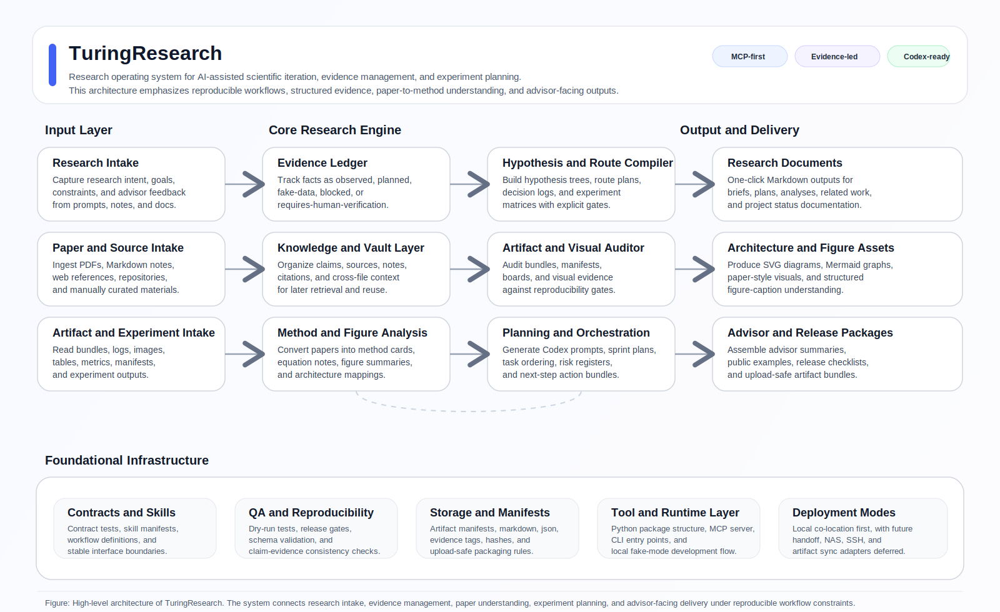

<p align="center">
  
</p>

<h1 align="center">TuringResearch</h1>

<p align="center">
  <b>A local-first research operating system for AI-assisted scientific iteration.</b>
</p>

<p align="center">
  Turn messy research goals into evidence ledgers, method cards, experiment routes, artifact audits, and advisor-ready reports.
</p>

<p align="center">
  <a href="#why-turingresearch">Why</a> ·
  <a href="#what-it-does">Features</a> ·
  <a href="#architecture">Architecture</a> ·
  <a href="#quickstart">Quickstart</a> ·
  <a href="#safety-boundaries">Safety</a> ·
  <a href="./README_CN.md">中文</a>
</p>

<p align="center">
  
  
  
  
  
</p>

---

## Why TuringResearch

Most AI tools can summarize a paper or draft a plan.

Real research is harder:

- advisor goals change;
- experiments produce incomplete evidence;
- artifact bundles get huge and messy;
- “planned”, “observed”, and “fake demo” results get mixed together;
- long-running Codex sessions drift away from the original objective;
- reports need to be honest enough for a mentor, not just polished enough for a README.

**TuringResearch is built for that gap.**

It helps organize the research loop:

```text
intent → literature → gap → hypothesis → route → experiment → artifact → report → next sprint
```

---

## What it does

TuringResearch focuses on research workflow infrastructure:

| Capability | What it helps with |
|---|---|
| Research intake | Convert fuzzy goals into constraints, non-goals, blockers, and next actions. |
| Evidence ledger | Separate observed facts, planned work, fake fixtures, missing papers, and missing experiments. |
| Literature workflow | Prepare survey plans, method cards, reference maps, and related-work positioning. |
| Hypothesis planning | Turn gaps into testable hypotheses and route trees. |
| Experiment runbooks | Compile Codex-ready long-horizon plans with hard gates and fallback branches. |
| Artifact audit | Track bundles, logs, boards, reports, hashes, missing files, and unsupported claims. |
| Advisor pack | Produce mentor-facing summaries, architecture diagrams, boundaries, and next-step plans. |
| Community intake | Accept idea documents and skill proposals without letting unreviewed code into the project. |

---

## Architecture

<p align="center">
  
</p>

The repository is intentionally **docs-first, evidence-first, and contract-first**.

---

## What is implemented vs planned

TuringResearch is a public release candidate. The README is conservative by design.

| Status | Meaning |
|---|---|
| Implemented | Code/docs/tests exist in this repo. |
| Partial | Working skeleton or workflow exists, but not full production scope. |
| Planned | Described as a roadmap item only. |
| Reference | Inspired by external/public projects; not claimed as TuringResearch output. |

No section in this README should imply that a planned module has already produced verified scientific results.

---

## Repository layout

```text
TuringResearch_plus/
├─ assets/                     # mascot and visual assets
├─ community/                  # idea and skill proposal intake
├─ docs/                       # manuals, policies, release docs, route reports
├─ examples/                   # public-safe examples and fake-mode demos
├─ lanes/                      # round-by-round ledgers and decision records
├─ src/                        # Python packages
│  ├─ tuling_research/         # historical implementation package
│  ├─ tuling_research_plus/    # historical plus package
│  ├─ turing_research/         # canonical public alias
│  └─ turing_research_plus/    # canonical public alias
├─ tests/                      # contract and workflow tests
├─ pyproject.toml
├─ README.md
└─ README_CN.md
```

The public project spelling is **TuringResearch**. The older `tuling_*` module paths are kept for backward compatibility, while the `turing_*` aliases are available for new users.

---

## Quickstart

```bash
git clone https://github.com/meamaturinlove221/TuringResearch_plus.git
cd TuringResearch_plus
python -m pip install -e .[dev]
python -m pytest
```

Optional local MCP smoke checks:

```bash
python -m turing_research.mcp_server --manifest
turingresearch-plus-mcp --health-check
```

Legacy commands remain available during the rename period:

```bash
python -m tuling_research.mcp_server --manifest
tulingresearch-plus-mcp --health-check
```

Default workflows should be safe to run without live API keys.

---

## Example workflows

Typical workflows this project is designed to support:

1. **Paper route planning** — turn a paper set into method cards, gap analysis, and experiment ideas.
2. **Long-horizon Codex planning** — compile route trees and hard gates into prompts that do not return too early.
3. **Artifact review** — inspect output bundles and decide whether claims are supported.
4. **Advisor report generation** — prepare clear reports with scope, evidence, failure modes, and next steps.
5. **Community idea intake** — let trusted collaborators submit idea/skill documents without changing code.

---

## Safety boundaries

TuringResearch should not:

- fake benchmark results;
- claim paper conclusions without sources;
- call live APIs by default;
- publish private paths, tokens, `.env`, cookies, or logs;
- redistribute restricted data or model assets;
- present reference-project ideas as untracked original output;
- mark planning-only workflows as production-ready.

The project prefers a boring but honest `planned` label over an impressive but false `done` label.

---

## Reference projects

Some public projects inspired parts of this repository’s workflow design and documentation style. They should be treated as **reference / inspiration**, not as silently migrated academic publications or hidden implementation sources.

When a reference project influences a module, the documentation should say so plainly and avoid overclaiming.

---

## Roadmap

Near-term directions:

- stronger artifact audit reports;
- better evidence ledger workflows;
- figure/table extraction planning;
- richer advisor-pack generation;
- cleaner modular repo presentation;
- friend/community skill proposal intake;
- optional live adapters behind explicit gates.

Deferred:

- ARIS-like homepage generation;
- automatic public release automation;
- automatic remote execution by default;
- unverified upstream “academic output” migration.

---

## Contributing

For implementation work, use maintainer-reviewed branches.

For idea and skill proposals, use the community intake flow:

```text
community/ideas/<github-username>/<idea-title>.md
community/skills/<github-username>/<skill-name>.md
```

Accepted proposals can later become feature capsules, skills, SOPs, campaign entries, or roadmap tasks.

---

## License

Check `LICENSE` before reuse. If the license file is not present in your local checkout, treat the project as not yet formally licensed for redistribution.

---

<p align="center">
  <b>TuringResearch makes research iteration clearer, more auditable, and less likely to drift.</b>
</p>
