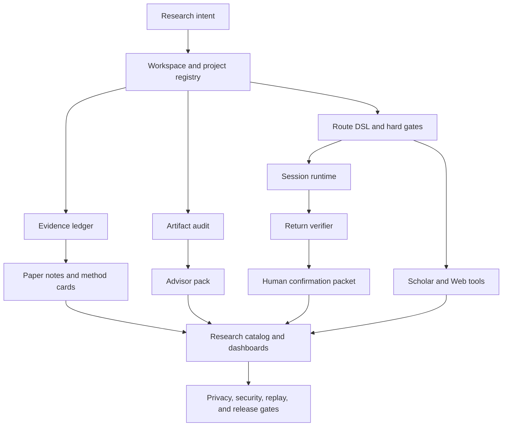

# TuringResearch

Local-first Research OS infrastructure for keeping research evidence, artifacts,
routes, paper notes, dashboards, plugins, and release gates reviewable.

TuringResearch helps researchers keep complex research state auditable without
pretending to automate judgment. It is fake/demo-first by default, privacy-first
by design, and built for human review.

TuringResearch is fake/demo-first by default.

It is not an autonomous scientist, not a hosted SaaS product, not a final-paper
generator, and not proof that any VGGT or SparseConv3D experiment succeeded.
It does not write final paper conclusions.

```text
Default mode: fake/local
Live mode: optional, private, and disabled by default
Remote execution: disabled by default
Evidence updates: require human review
Public release actions: require maintainer approval
```

Start here:

- [Quickstart](docs/quickstart.md)
- [v1.0 Public Quickstart](docs/v1.0.0-quickstart.md)
- [Public demo walkthrough](docs/v1.0.0-public-demo-walkthrough.md)
- [Docs index](docs/docs-index.md)
- [Public showcase](docs/public-showcase.md)
- [Original repo parity dashboard](docs/original-repo-parity-dashboard-v2.md)
- [v1.1 final scope](docs/v1.1.0-final-scope.md)
- [v1.6 final handoff](docs/v1.6.0-handoff.md)
- [Visual tour plan](docs/readme-visual-asset-plan.md)

## What Is TuringResearch?

TuringResearch organizes research work as typed, reviewable local state:

- what is planned;
- what has evidence;
- what is missing;
- which artifacts are safe to share;
- which experiment routes are blocked;
- which paper, web, and advisor claims still need human review.

The goal is not to make software declare research complete. The goal is to keep
research work inspectable, replayable, and honest while humans make the
scientific decisions.

## Why It Exists

## Problem

Research projects often spread across notebooks, papers, run folders, remote
machines, advisor notes, dashboards, and half-remembered claims. The hard part
is not just generating more text. The hard part is keeping the work honest.

TuringResearch makes these boundaries explicit:

- planned work is not observed evidence;
- fake/demo output is not a research result;
- retrieved paper or web context is not automatically verified;
- remote return artifacts do not enter an evidence ledger without confirmation;
- public demos must not expose private paths, raw data, secrets, or restricted
  model payloads.

## Architecture



The default path should run without API keys, live network access, Modal,
SSH/SFTP, private project folders, raw datasets, or restricted body-model files.

## Core Modules

## Core Capabilities

| Area | What it does | Default boundary |
| --- | --- | --- |
| Workspace | Project registries, templates, cross-project summaries | local files only |
| Evidence | Claim status, planned/observed separation, ledgers | no automatic promotion |
| Artifact audit | Public-safety checks for files and handoff bundles | no raw data packaging |
| Route DSL | Experiment intent, hard gates, failure taxonomy | runbook only |
| Session runtime | Preflight, context pack, script export, fake transfer, return verification | no remote command execution |
| Scholar tools | Paper search/content/reference/reading fake workflows | no paper download by default |
| Web tools | URL normalization, cache manifests, content extraction fixtures | no default network or private scraping |
| Research catalog | Catalog, vault/wiki, ontology, stress, convergence reports | review-only outputs |
| Dashboard | Static local HTML/Markdown views and public demo surfaces | no hosted service required |
| MCP / plugins | Local MCP config, plugin manifests, compatibility reports | plugin/live tools disabled by default |
| Privacy and release gates | Secret scans, name integrity, replay, regression checks | public-safe review first |

## Quickstart

Install locally in editable mode:

```powershell
python -m pip install -e .[dev]
```

Run the default fake/local checks:

```powershell
python -m pytest -q
python -m mypy src
```

Default tests use fake services, local fixtures, and dry-run workflows.
They do not require real API keys or live network access.

Try the public-safe quickstart path:

```powershell
python -m pytest tests/workflow/test_public_demo_suite.py tests/workflow/test_public_demo_expansion.py -q
python -m pytest tests/workflow/test_v1_public_quickstart_fake.py -q
```

Useful entry points:

- [Install guide](docs/install.md)
- [Local install smoke](docs/local-install-smoke.md)
- [Examples](docs/examples.md)
- [Docs home](docs/README.md)

## Public Demo

The public demo is fake/demo only. It does not require private data, API keys,
VGGT data, restricted model files, remote machines, or live network access.

Open or inspect:

- `examples/public_demo/README.md`
- `examples/public_demo/QUICKSTART.md`
- `examples/public_demo/WALKTHROUGH.md`
- `examples/public_demo/dashboard/index.html`
- `examples/public_demo/projects/vggt_like_demo/`
- `examples/public_demo/projects/paper_survey_demo/`
- `examples/public_demo/projects/software_tooling_demo/`

The demo shows evidence ledger inspection, artifact review, static dashboards,
advisor-pack material, and benchmark replay. It does not run real experiments,
does not generate real research results, and does not turn fake/demo material
into observed evidence.
TuringResearch does not turn fake/demo material into observed evidence.

## VGGT Case Study

The VGGT-style case material is a public-safe review/demo surface only. It is
not proof that any VGGT experiment succeeded, does not claim VGGT experiment
success or SparseConv3D success, and does not turn fake/demo material into
observed evidence.
This README does not claim VGGT experiment success or SparseConv3D success.

## Original Repo Production Parity

## v1.3 Original Reference Parity

v1.3 Original Reference Parity covered Neocortica Session parity, Neocortica
Neocortica Scholar parity, Neocortica Web parity, yogsoth parity, ARIS
deferral, no automatic remote execution, the Fake / Live Boundary, and
Privacy-first public docs.

ARIS | deferred and reference-only. There is no cross-model review, no
proof-checker, no meta-optimize, no paper-claim-audit, and no default network.

## v1.4 Original Repo Production Parity

v1.4 Original Repo Production Parity kept Neocortica Session, Neocortica
Scholar, Neocortica Web, and yogsoth-ai production parity in fake/default mode.
It preserved no default network, no remote command execution, the Fake / Live
Boundary, and Privacy-first release gates. See
`docs/original-repo-production-parity-summary.md` and
`docs/original-repo-parity-dashboard-v2.md`.

TuringResearch has replicated the stable, public, production-relevant ideas
from the original reference repositories into local fake/default workflows. It
does not copy unsafe behavior and does not claim live-provider proof.

| Reference area | Current status | Boundary |
| --- | --- | --- |
| Neocortica Session | production parity for fake/default local workflows | no default SSH/SFTP, tmux, provisioning, or remote command execution |
| Neocortica Scholar | production parity for fake/default paper tooling | no MinerU, heavy OCR, paper download, paywall bypass, or fake citation verification |
| Neocortica Web | production parity for fake/default web tooling | no default network, private scraping, cookies, login bypass, or live Apify |
| yogsoth-ai | production parity with deterministic review workflows | no autonomous agent runtime or automatic experiment execution |
| ARIS | deferred | future study only; no cross-model review, proof-checker, meta-optimize, or paper-claim-audit |

Read more:

- [Original repo replication progress report](docs/original-repo-replication-progress-report.md)
- [Original repo replication scorecard](docs/original-repo-replication-scorecard.md)
- [Original repo production parity summary](docs/original-repo-production-parity-summary.md)
- [Original repo parity dashboard v2](docs/original-repo-parity-dashboard-v2.md)

## Docs Site Ready

The v1.6 docs site is GitHub Pages-ready for human review, but not deployed.

Ready:

- docs-site preflight;
- GitHub Pages dry-run workflow draft;
- local static release bundle;
- release bundle manifest and hash report;
- safety checklist and no-fake-URL boundary.

Not implied: a public docs site exists.

See:

- [Docs deployment gate](docs/v1.6.0-docs-deployment-gate-report.md)
- [Docs release bundle](docs/docs-release-bundle.md)
- [GitHub Pages workflow draft](docs/github-pages-workflow-draft.md)

## Dashboard Showcase

The dashboard showcase is static/local-first and ready for review. It is not a
hosted dashboard service and does not run live providers.

Local showcase pages:

- `examples/public_demo/dashboard_showcase/landing.html`
- `examples/public_demo/dashboard_showcase/parity.html`
- `examples/public_demo/dashboard_showcase/interview.html`

See:

- [Dashboard UX gate](docs/v1.5.0-dashboard-ux-gate-report.md)
- [Dashboard landing page](docs/dashboard-landing-page.md)
- [Parity showcase view](docs/parity-showcase-view.md)
- [Interview demo view](docs/interview-demo-dashboard-view.md)

## Split Manual Packs

Split repositories are planned / manual-ready only. The main TuringResearch
repository remains the only install, test, release, docs, issue, and star
entry. Child repositories, if created later by a human, are optional case/demo
spokes and must point back to the flagship repository.

The main TuringResearch repository remains the only install entry. Split-ready
bundles are local export bundles, not published GitHub repositories, and not
install targets. The main repository remains the star entry.

## Planned Split Repositories

Planned split repositories are manual-ready case/demo spokes only. They are not
published GitHub repositories and are not install targets before a maintainer
creates and reviews them.

Manual pack surfaces:

- `split_ready/`
- `split_manual/turingresearch-vggt-case/`
- `split_manual/turingresearch-examples/`

No real GitHub URLs are listed until a maintainer manually creates and approves
the repositories.

See:

- [Split final safety refresh](docs/split-final-safety-refresh-v1.6.md)
- [Physical split execution policy](docs/physical-split-execution-policy.md)
- [Split manual packs](docs/split-manual-packs.md)

## Fake / Live Boundary

TuringResearch is fake/local by default. Live providers are private opt-in
surfaces, not default release behavior.

## MCP, Plugins, And Optional Live

The MCP and plugin surfaces are designed for local review first.

Optional MCP smoke check:

```powershell
python -m pip install -e .[dev,mcp]
python -m turing_research.mcp_server --manifest
turingresearch-plus-mcp --health-check
```

Compatibility names retained for now:

- package distribution: `turingresearch-plus`;
- MCP server key: `turingresearch-plus`;
- console command: `turingresearch-plus-mcp`;
- Python compatibility namespace: `turing_research_plus`.

These are compatibility surfaces, not the public project name. The public
project name is TuringResearch.

Live adapters are optional and disabled by default:

```text
TURINGRESEARCH_MODE=fake
TURINGRESEARCH_ENABLE_LIVE_TESTS=0
TURINGRESEARCH_ENABLE_SEMANTIC_SCHOLAR_LIVE=0
TURINGRESEARCH_ENABLE_WEB_LIVE=0
TURINGRESEARCH_ENABLE_APIFY_LIVE=0
TURINGRESEARCH_ENABLE_SFTP_LIVE=0
TURINGRESEARCH_ENABLE_PLUGINS=0
TURINGRESEARCH_ENABLE_PLUGIN_LIVE_MODE=0
```

Source Hygiene blocks unsafe or unauthorized source material. Plugin tools,
live providers, SSH/SFTP transfer, and network access require explicit private
opt-in and human review.

## Plugin Safety

Plugin tools are local-review surfaces by default. They do not get shell,
secret, network, remote-write, or live-provider access unless a maintainer
explicitly enables a reviewed private configuration.

## Privacy-first

## Safety And Privacy Boundary

TuringResearch is privacy-first by default.

Public material must exclude:

- secrets, API keys, tokens, cookies, and private credentials;
- `.env` files and private local config;
- private local paths;
- raw data and large private artifacts;
- restricted model payloads;
- unsupported experiment claims;
- fake/demo output presented as observed evidence.

Return artifacts and generated reports are review inputs. They are not
automatically written to an evidence ledger and are not public claims until a
human reviewer approves them.

See:

- [Open source hygiene gate](docs/open-source-hygiene-gate-report.md)
- [Security policy](SECURITY.md)
- [Optional live safety policy](docs/optional-live-safety-policy.md)
- [Public naming policy](docs/turingresearch-public-naming-policy.md)

## What It Is Not

## Limitations

TuringResearch does not:

- automatically complete research;
- automatically run real experiments;
- automatically write final papers or final paper conclusions;
- replace human review;
- prove VGGT success;
- claim SparseConv3D success;
- bypass paywalls or logins;
- scrape private content;
- default to live networking;
- default to SSH/SFTP or remote execution;
- execute unknown plugins by default;
- upload private data by default;
- guarantee publication, stars, users, adoption, or benchmark outcomes;
- guarantee star growth;
- rely on invented users, invented social proof, or invented benchmark claims.

## v1.6 Release Candidate Status

v1.6 is ready for human release-candidate review, not automatic publication.

Ready with human review:

- docs deployment-ready bundle;
- dashboard showcase;
- split manual packs;
- optional live smoke policies and skipped-live tests;
- local package/install readiness;
- release artifact dry-run posture;
- public launch checklist and hygiene gates.

Not performed:

- PyPI publication;
- GitHub release publication;
- tag creation;
- GitHub Pages deployment;
- child repository creation;
- live provider execution;
- remote command execution;
- ARIS implementation.

See:

- [v1.6 final archive](docs/v1.6.0-final-archive.md)
- [v1.6 handoff](docs/v1.6.0-handoff.md)
- [What is ready](docs/v1.6.0-what-is-ready.md)
- [What is not ready](docs/v1.6.0-what-is-not-ready.md)
- [Next human actions](docs/v1.6.0-next-human-actions.md)

## Roadmap

Near-term public-release work focuses on maintainer review and manual public
actions:

1. final README and public docs review;
2. docs deployment approval without fake public URLs;
3. split-repo creation approval, if desired;
4. package naming and PyPI decision;
5. release notes and GitHub release draft review;
6. screenshot/demo asset review;
7. post-release verification.

ARIS remains deferred. It may return as a separately scoped study track, not as
a default implementation line.

## License

The current repository license is proprietary. See [LICENSE](LICENSE) and
[license review](docs/license-review.md). The open source license decision is
still pending human approval; see
[open source license decision](docs/open-source-license-decision.md) and
[open source compliance checklist](docs/open-source-compliance-checklist.md).

Do not assume PyPI publication, third-party redistribution, or public release
approval until maintainers make a separate explicit release decision.

## Citation And Governance

- [Citation metadata](CITATION.cff)
- [Contributing guide](CONTRIBUTING.md)
- [Code of conduct](CODE_OF_CONDUCT.md)
- [Security policy](SECURITY.md)

These files are public-review drafts. They do not replace maintainer license,
privacy, security, or compliance review.

## Acknowledgements And References

TuringResearch references public research-tooling ideas from Neocortica-style
Session, Scholar, and Web workflows, and yogsoth-ai-style research workflow
organization. Those projects are references for ideas and parity targets. This
repository uses its own implementation, safety boundaries, naming, tests, and
release gates.

ARIS remains a future reference only and is not implemented in the default
runtime.
