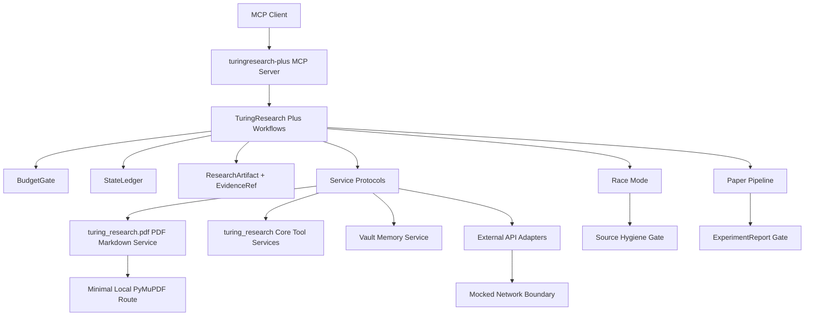

# TuringResearch Plus Architecture

TuringResearch Plus is organized around contract-first services. The Plus workflow layer calls stable service protocols and adapters; it does not call Core internals directly.

## Layers

- Core layer: stable local tools under `src/turing_research/`.
- PDF layer: Phase 1 PDF input and Markdown result models under `src/turing_research/pdf/`.
- Plus layer: workflow-facing models under `src/turing_research_plus/`.
- Contracts: YAML interface contracts under `contracts/`.
- Lanes: single-window parallel work state under `lanes/`.

## Invariants

- Contracts come before models and implementations.
- External APIs are accessed through adapters.
- Network tests are mocked.
- Workflows expose `dry_run` and fake-service operation.
- Important outputs become `ResearchArtifact`.
- Conclusions carry `EvidenceRef`.

## MCP Namespaces

TuringResearch Plus exposes planned MCP tools through `turingresearch-plus` using these namespaces:

- `core.*`: Core health, local content, session, and future adapter-backed paper/web tools.
- `pdf.*`: Local PDF inspection, Markdown conversion, cache lookup, and future extraction/OCR contracts.
- `graph.*`: Paper graph, reference, citation, recommendation, and author-network contracts.
- `research.*`: Fusion research workflow contracts from north-star setup through implementation planning.
- `vault.*`: Evidence-preserving memory and graph store contracts.
- `context.*`: Workflow context checkpoint, recovery, index, and summary contracts.
- `race.*`: Source hygiene, idea, feature capsule, architecture box, and upstream-watch contracts.
- `paper.*`: Article block, SOP graph, figure, caption, draft, evidence, and LaTeX export contracts.

For `v0.1.0`, the release surface includes local Core tools, PDF Markdown Phase A, fake-adapter Semantic Graph, dry-run research workflows, Vault/Context basics, Race Mode basics, Feature Capsule skeletons, DocFlow, figure registry, paper draft gate, examples, package entry points, and CI checks. Network behavior remains adapterized and mocked in tests.
