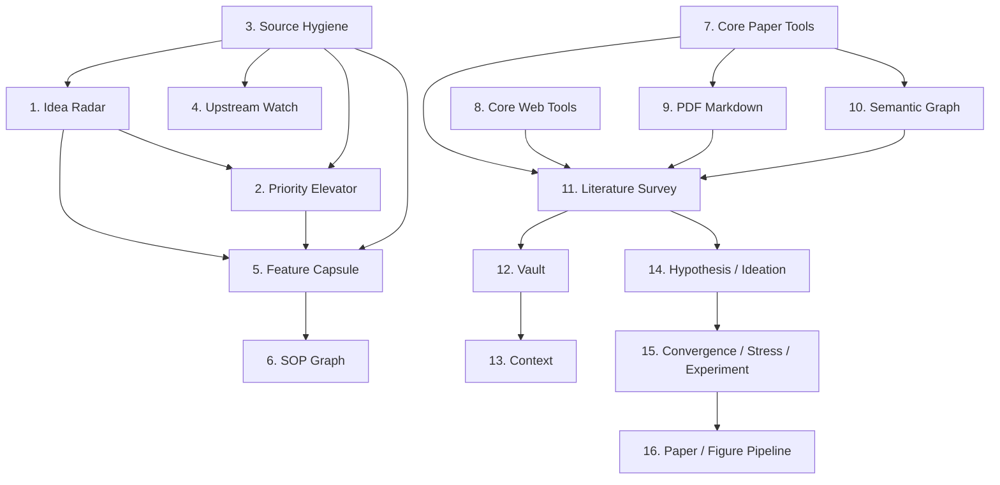

# TulingResearch Plus 16-Box Architecture

This document is generated from `src/tuling_research_plus/race/architecture_box.py`.

| Box | Name | Goal | Owner skill | Public tools | Modules | Inputs | Outputs | Tests | Priority | Dependencies |
| --- | --- | --- | --- | --- | --- | --- | --- | --- | --- | --- |
| 01 | Idea Radar | Extract public or authorized Race Mode ideas from noisy text. | `tulingresearch-race-idea-radar` | `race.idea_extract` | `src/tuling_research_plus/race/idea_radar.py` | `SourceMaterial` | `IdeaCard` | `tests/unit/test_idea_radar.py` | P0 | 03 |
| 02 | Priority Elevator | Rank IdeaCards into P0/P1/P2/P3 for release planning. | `tulingresearch-race-priority-elevator` | `race.priority_score` | `src/tuling_research_plus/race/priority_elevator.py` | `IdeaCard` | `PriorityRecommendation` | `tests/unit/test_priority_elevator.py` | P0 | 01, 03 |
| 03 | Source Hygiene | Block private, leaked, NDA, proprietary, or incompatible sources. | `tulingresearch-race-source-hygiene` | `race.source_hygiene_check` | `src/tuling_research_plus/race/source_hygiene.py` | `SourceMaterial` | `SourceHygieneCheckResult` | `tests/unit/test_source_hygiene.py` | P0 | - |
| 04 | Upstream Watch | Track public upstream changes without converting unclear sources to tasks. | `tulingresearch-race-upstream-watch` | `race.upstream_watch` | `src/tuling_research_plus/race/upstream_watch.py` | `SourceHygieneCheckResult` | `UpstreamWatchReport` | `tests/unit/test_upstream_watch.py` | P2 | 03 |
| 05 | Feature Capsule | Turn P0/P1 IdeaCards into self-contained feature capsule skeletons. | `tulingresearch-race-feature-capsule-factory` | `race.feature_capsule_create` | `src/tuling_research_plus/race/feature_capsule.py` | `IdeaCard`, `PriorityRecommendation` | `FeatureCapsule` | `tests/unit/test_feature_capsule.py` | P1 | 01, 02, 03 |
| 06 | SOP Graph | Represent feature and workflow procedures as Mermaid SOP graphs. | `tulingresearch-paper-sop-graph-generator` | `paper.sop_graph_generate` | `sop_graphs/feature_graphs/` | `FeatureCapsule` | `SOPGraph` | `tests/unit/test_sop_graph.py` | P1 | 05 |
| 07 | Core Paper Tools | Expose local paper content and future paper services through Core. | `tulingresearch-core-reproduction` | `core.paper_content`, `core.paper_searching`, `core.paper_fetching` | `src/tuling_research/scholar/` | `PaperContentRequest` | `PaperContent` | `tests/unit/test_paper_content_service.py` | P0 | - |
| 08 | Core Web Tools | Expose local web content services without direct network coupling. | `tulingresearch-core-reproduction` | `core.web_content`, `core.web_fetching` | `src/tuling_research/web/` | `WebContentRequest` | `WebContent` | `tests/unit/test_web_content_service.py` | P0 | - |
| 09 | PDF Markdown | Convert local PDFs to cached markdown with lightweight quality checks. | `tulingresearch-pdf-markdown-core` | `pdf.inspect`, `pdf.to_markdown`, `pdf.markdown_content` | `src/tuling_research/pdf/` | `PDFMarkdownInput` | `PDFMarkdownOutput` | `tests/unit/test_pdf_markdown_pipeline.py` | P0 | 07 |
| 10 | Semantic Graph | Support citation, reference, recommendation, and author graph workflows. | `tulingresearch-fusion-semantic-graph` | `graph.paper_lookup`, `graph.citation_graph_expand` | `src/tuling_research_plus/semantic_graph/` | `PaperNode` | `CitationGraph` | `tests/unit/test_citation_graph.py` | P1 | 07 |
| 11 | Literature Survey | Run depth-gated literature survey workflows. | `tulingresearch-fusion-literature-survey` | `research.survey_plan`, `research.survey_run` | `src/tuling_research_plus/survey/` | `SurveyInput` | `LiteratureSurveyArtifact` | `tests/workflow/test_literature_survey_dry_run.py` | P1 | 07, 08, 09, 10 |
| 12 | Vault | Persist research artifacts and graph memory in markdown vault form. | `tulingresearch-fusion-wiki-vault` | `vault.search`, `vault.ingest_source`, `vault.query_graph` | `src/tuling_research_plus/vault/` | `ResearchArtifact` | `VaultPage`, `VaultEdge` | `tests/unit/test_vault_artifact_ingestion.py` | P1 | 11 |
| 13 | Context | Checkpoint and recover long-running research workflow context. | `tulingresearch-fusion-context-management` | `context.init`, `context.checkpoint`, `context.recover` | `src/tuling_research_plus/context/` | `ResearchArtifact` | `ContextCheckpoint` | `tests/unit/test_context_service.py` | P1 | 12 |
| 14 | Hypothesis / Ideation | Turn gaps into hypotheses, research questions, and diverse ideas. | `tulingresearch-fusion-hypothesis-formation` | `research.hypothesis_generate`, `research.idea_generate` | `src/tuling_research_plus/hypothesis/`, `src/tuling_research_plus/ideation/` | `GapValidationReport`, `HypothesisSet` | `HypothesisPortfolio`, `IdeaPortfolio` | `tests/unit/test_hypothesis_portfolio.py`, `tests/unit/test_idea_generation.py` | P1 | 11 |
| 15 | Convergence / Stress / Experiment | Rank ideas, stress-test decisions, and design dry-run experiments. | `tulingresearch-fusion-convergence` | `research.portfolio_optimize`, `research.artifact_stress_test`, `research.experiment_design` | `src/tuling_research_plus/convergence/`, `src/tuling_research_plus/stress/`, `src/tuling_research_plus/experiment/` | `IdeaPortfolio`, `HypothesisPortfolio` | `DecisionReport`, `StressTestReport`, `ExperimentPlan` | `tests/unit/test_portfolio_optimize.py`, `tests/unit/test_experiment_design.py` | P1 | 14 |
| 16 | Paper / Figure Pipeline | Turn experiment evidence into article blocks, figures, captions, and drafts. | `tulingresearch-paper-writing-pipeline` | `paper.article_block_update`, `paper.figure_register`, `paper.draft_generate` | `src/tuling_research_plus/paper/` | `ExperimentReport`, `ArticleBlock` | `PaperDraft` | `tests/unit/test_article_block.py` | P2 | 15 |

## Mermaid

