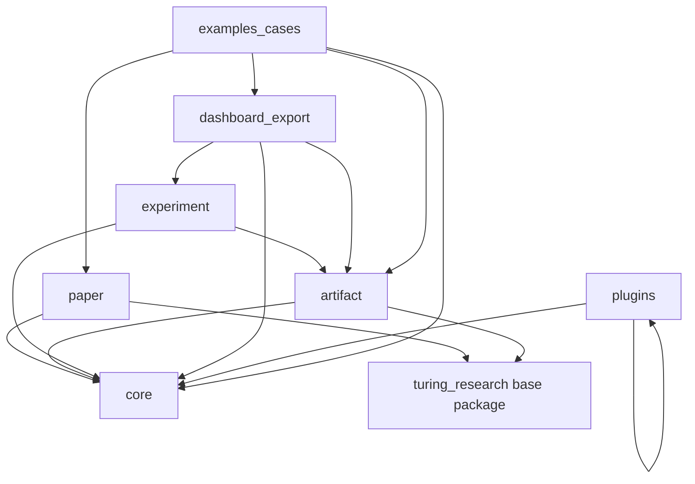

# Module Dependency Graph

Status: audit artifact.

Round: 152.

This document summarizes the current module dependency shape from a read-only
top-level import scan. It is an audit aid, not a generated build graph.

## Group-level Graph

## Notable Top-level Edges

| Source | Depends on | Risk |
| --- | --- | --- |
| `plugins` | `capabilities`, `extension_safety`, `mcp_plugins` | Two-way risk with MCP plugin registry. |
| `mcp_plugins` | `plugins` | Two-way risk with plugin registry. |
| `remote_artifacts` | `github_sync`, `object_store`, `remote_readers`, `shared_store` | Facade can hide live/safety boundaries if not documented. |
| `advisor` | `artifact_audit`, `artifacts`, `vggt` | Case-specific coupling before standalone export split. |
| `paper` | `turing_research.pdf`, `artifacts` | Future paper split needs stable PDF/artifact contract. |
| `dashboard` | `failure`, `run_ingest` | Local server dashboard should depend on stable DTOs. |
| `run_compare` | `dashboard` | Run comparison currently layers over dashboard outputs. |
| `cross_project` | `workspace` | Expected; workspace should remain a core dependency. |
| `experiment_route` | `hard_gates` | Expected; routes depend on hard gate semantics. |
| `run_ingest` | `artifacts`, `failure` | Expected; run status and failure taxonomy are coupled. |

## Top-level Internal Dependency Counts

| Module | Internal dependencies |
| --- | --- |
| `turing_research.mcp_server` | 7 |
| `turing_research_plus.campaign` | 4 |
| `turing_research_plus.remote_artifacts` | 4 |
| `turing_research_plus.sop` | 4 |
| `turing_research_plus.advisor` | 3 |
| `turing_research_plus.plugins` | 3 |
| `turing_research_plus.dashboard` | 2 |
| `turing_research_plus.paper` | 2 |
| `turing_research_plus.run_ingest` | 2 |

## Low-coupling Modules

The scan found many modules with no top-level dependency on other
TuringResearch Plus modules. These are better candidates for future API
stabilization or standalone docs:

- `advisor_export`
- `artifact_audit`
- `benchmark`
- `case_study`
- `collision`
- `compliance`
- `extension_safety`
- `handoff`
- `paper_write`
- `privacy`
- `project_template`
- `quality`
- `related_work`
- `ui`
- `vault_graph`
- `workspace`

Low coupling does not automatically mean split-ready. A module still needs
stable API, docs, tests, demo, license review, and independent value.

## Boundary Recommendation

- Make plugin -> MCP mapping one-way before splitting plugin packages.
- Keep workspace/privacy/quality/project-template semantics in the flagship.
- Treat remote artifact modules as audit/fake-default surfaces until live
  adapter boundaries are stable.
- Extract case-specific VGGT inputs from generic advisor/export APIs before
  splitting dashboard/export.
- Define dashboard DTOs before local server dashboard work.
