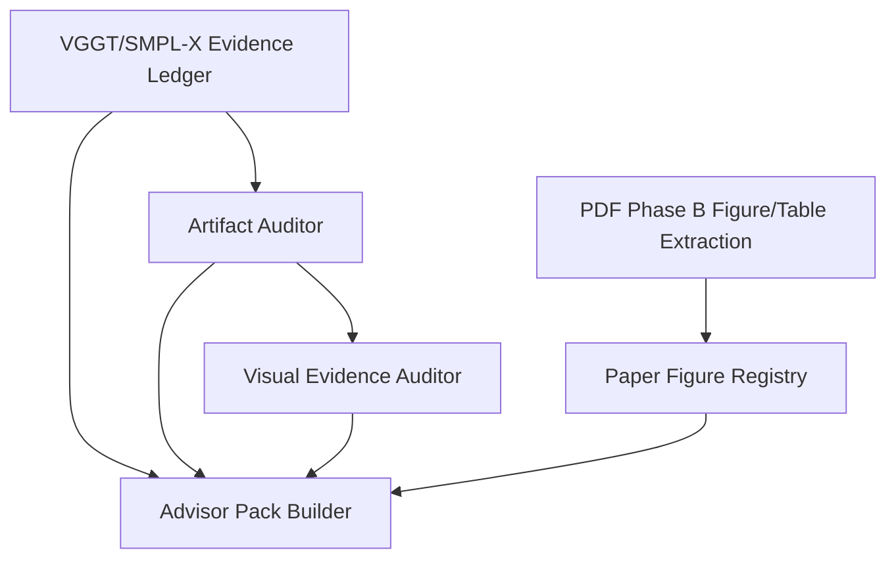

# TuringResearch Plus v0.2.0 Sprint 1 Implementation Order

Round 36 recommends this order for the later Sprint 1 implementation rounds.
This document does not authorize code changes by itself.

## Recommended Order

1. VGGT/SMPL-X Evidence Ledger
2. Artifact Auditor
3. Visual Evidence Auditor
4. Advisor Pack Builder
5. PDF Phase B Figure/Table Extraction

## Rationale

| Order | Item | Why here | Required before starting |
| ---: | --- | --- | --- |
| 1 | VGGT/SMPL-X Evidence Ledger | Evidence Ledger is the evidence substrate for the other features. It prevents `observed`, `local-observed`, `review-ready-proxy`, and `requires-human-review` from being mixed. | Contract update; status enum; fake milestone fixtures. |
| 2 | Artifact Auditor | Artifact Auditor records zip/json/npz/board inventory, checksums, sidecars, missing items, and bundle diffs. It feeds the evidence ledger. | Evidence Ledger status model. |
| 3 | Visual Evidence Auditor | Visual Evidence Auditor depends on Artifact Auditor board inventory to classify proxy heatmaps, mask/delta boards, pointcloud proxies, and true region pointcloud closeups. | Artifact inventory records and visual sidecar fixtures. |
| 4 | Advisor Pack Builder | Advisor Pack Builder depends on Evidence Ledger and auditor outputs. It must block missing visual inventory and avoid promotion wording. | Evidence Ledger outputs; Artifact Auditor summary; Visual Evidence Auditor summary. |
| 5 | PDF Phase B Figure/Table Extraction | PDF Phase B can proceed independently, but outputs must align with paper figure registry, table metadata, page provenance, and future method-card workflows. | Existing PDF Phase B contracts; figure registry provenance expectations. |

## Contract-First Sequence

For each item:

1. Update the relevant contract.
2. Add or update Pydantic models.
3. Add focused unit and contract tests using fake/local fixtures.
4. Implement the minimal deterministic behavior.
5. Update docs and Lane 14.

## Cross-Item Dependencies

## First Implementation Slice

The safest first slice is the Evidence Ledger contract and tests:

- define status labels and milestone rows
- ensure V120/V121 remain `requires-human-review` without local evidence
- serialize ledger rows to Markdown and JSON
- reject promotion wording in ledger outputs

No live adapter, remote sync, or VGGT execution belongs in this first slice.
