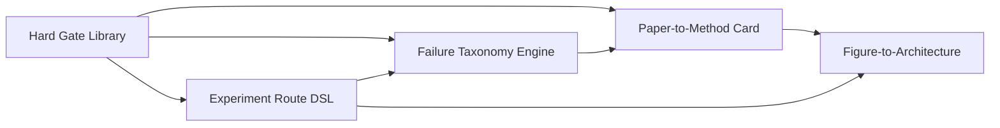

# TuringResearch Plus v0.2.0 Sprint 2 Implementation Order

Status: scope locked.

Sprint 2 implements the same selected feature set as the requested baseline,
but follows the Round 43 recommended order so shared gates and failure semantics
exist before higher-level route and paper workflows rely on them.

## Order

1. Hard Gate Library
2. Experiment Route DSL
3. Failure Taxonomy Engine
4. Paper-to-Method Card
5. Figure-to-Architecture

## Rationale

### 1. Hard Gate Library

Build this first because Sprint 1 already repeats the same gate patterns across
Evidence Ledger, Visual Evidence Auditor, Advisor Pack Builder, DocFlow, and PDF
Phase B. A shared library keeps promotion rules explicit and testable.

Expected first outputs:

- `GateSpec`
- `GateResult`
- reusable status labels
- Markdown gate summary
- blocked / requires-human-review reasoning

### 2. Experiment Route DSL

After gates exist, represent VGGT long-running routes as structured plans. The
DSL should describe route steps, expected evidence, hard gates, fallback gates,
and stop conditions. It is not a live executor.

Expected first outputs:

- route schema
- route parser
- route Markdown export
- route checkpoint summary
- examples for V260, V770, V999, and Modal Real SparseConv3D planning

### 3. Failure Taxonomy Engine

Normalize the failure language used by route plans, evidence ledgers, advisor
packs, and stress reports. This keeps "fast return", "fallback-only",
"report-only", "visual not-ready", and "not enough evidence" from being treated
as interchangeable.

Expected first outputs:

- taxonomy schema
- severity mapping
- failure normalization
- next-action recommendation stub
- regression examples for not-ready VGGT claims

### 4. Paper-to-Method Card

Once routes and failure language are stable, convert paper-derived information
into provenance-backed method cards. This should consume local paper metadata,
PDF Phase B asset reports, and explicit evidence refs. It must not infer method
claims from missing or scanned-only sources.

Expected first outputs:

- `MethodCard`
- paper provenance block
- method components
- evidence-backed limitations
- `requires-real-paper` fallback when inputs are incomplete

### 5. Figure-to-Architecture

Build graph drafts from Method Cards, figures, and route structures only after
those inputs exist. Output is an architecture draft, not proof that the method
or experiment has been implemented.

Expected first outputs:

- figure-to-component map
- Mermaid export
- Graphviz export plan or stub
- unsupported-edge warnings
- architecture draft Markdown

## Dependency Chain

## Contracts To Write Before Code

1. `contracts/hard_gates.yaml`
2. `contracts/experiment_routes.yaml`
3. `contracts/failure_taxonomy.yaml`
4. `contracts/method_cards.yaml`
5. `contracts/figure_architecture.yaml`

## Implementation Guardrails

- Keep every service deterministic and local-first.
- Keep live execution and live APIs out of Sprint 2.
- Keep VGGT local private paths out of default tests.
- Do not add public tool namespaces without a contract update.
- Do not promote planned route outcomes to observed evidence.
